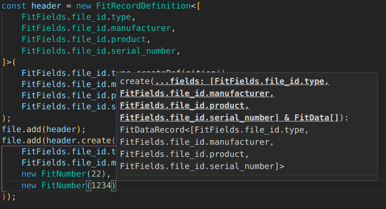

= Fit Writer
:toc:
:toc-placement!:
:fitwriter: fit-writer
:fit: link:https://www.thisisant.com/resources/fit[FIT]
ifdef::env-github[]
:tip-caption: :bulb:
:note-caption: :information_source:
:important-caption: :heavy_exclamation_mark:
:caution-caption: :fire:
:warning-caption: :warning:
endif::[]

A TypeScript-powered library to write {fit} files.

toc::[]

== Features

{fitwriter} uses the pairing of definition messages with one or more data messages (the foundation of the {fit} format) to drive the API design.

[source,typescript]
----
const file = new FitFile();

const header = new FitRecordDefinition<[
    FitFields.file_id.type, FitFields.file_id.manufacturer,
    FitFields.file_id.product, FitFields.file_id.serial_number,
]>(
    FitFields.file_id.type.createDefinition(),
    FitFields.file_id.manufacturer.createDefinition(),
    FitFields.file_id.product.createDefinition(),
    FitFields.file_id.serial_number.createDefinition(),
);
file.add(header);
file.add(header.create(
    FitFields.file_id.type.activity(),
    FitFields.file_id.manufacturer.development(),
    new FitNumber(22),
    new FitNumber(1234),
));
----

Re-use the same definition messages::
Provide a single definition message, then create multiple data messages from that definition.
Strongly typed definition and data messages::
The parameters when creating a new `FitRecordDefinition` or creating data messages must match the defined format.
This means that your IDE and compiler can both complain if you don't provide all the fields defined, or if the fields aren't in the correct order.
Field values are strongly typed::
You can't pass a string to a number field.  Enum fields require specific members.
Record structure is enforced::
You can't use fields only allowed in the `file_id` record inside activity records.
Editor support for parameters::
Your editor may be able to describe the desired parameters, and perform smart autocompletion with variables that match the desired types.
+++

Example

+++

+++

+++
